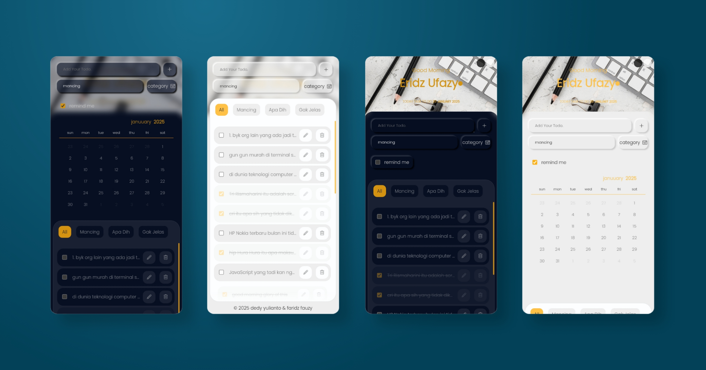

# 📝 Oh My Todo - Template Website To-Do List

**Oh My To-Do** adalah template **website to-do list open-source** berbasis HTML, CSS, dan JavaScript.

- Responsif, ringan, tanpa framework, dan bisa langsung digunakan.
- Menyimpan tugas dengan LocalStorage, mendukung tema Dark & Light, serta kategori tugas.
- Cocok untuk developer pemula maupun profesional yang ingin membuat aplikasi to-do list modern.

<br />

## 🚀 **Demo & Live Preview**

🔗 [Lihat Demo di Sini](https://eridz.github.io/oh-my-todo/)

<!---->



<br />

## ✨ **Fitur utama:**

- Template siap pakai
- Desain responsif (Mobile-Friendly)
- Penyimpanan dengan `localStorage`
- Tanpa framework (murni `HTML`, `CSS`, `JavaScript`)
- Menambahkan, mengedit & Menghapus Tugas
- Kategori Tugas
- Tema Dark & Light
- Animasi Smooth
- Tema mudah dikustomisasi (`assets > css > color-variabel.css`)

<br />

## 📥 **Download & Install**

### **1. Clone Repository**

```sh
  git clone https://github.com/eridz/oh-my-todo.git
```

atau download sebagai [ZIP](https://github.com/eridz/oh-my-todo/archive/refs/heads/main.zip) dari GitHub.

### **2. Buka folder di kode editor**

```sh
  code oh-my-todo
```

atau jika kalian pakai [Acode Editor](https://acode.app/) di Android

```sh
  acode oh-my-todo
```

<br />

## 📁 Struktur Folder

```txt
oh-my-todo/
├── assets
│   ├── css/        # File CSS untuk styling
│   ├── fonts/      # Font yang digunakan dalam aplikasi
│   ├── images/     # Gambar dan ikon
│   └── js/         # File JavaScript utama
│
├── index.html      # Halaman utama aplikasi
├── LICENSE         # Lisensi proyek
└── README.md       # Dokumentasi proyek
```

<br />

## 🛠 Cara Menggunakan

**Tambahkan Tugas Baru**

- Ketik tugas di input box
- Tekan tombol ➕ untuk menambah tugas

**Simpan tugas di LocalStorage**

- Tugas akan tersimpan, meskipun halaman direfresh tidak akan hilang

**Tandai Tugas Selesai**

- Klik checkbox ✅ untuk menandai tugas sebagai selesai

**Edit Tugas**

- Klik ikon pencil 🖊️ untuk mengedit tugas, lalu tekan **Save**

**Hapus Tugas**

- Klik ikon 🗑 untuk menghapus tugas dari daftar

<br />

## 🔍 Teknologi yang Digunakan

- **HTML5** → Struktur halaman

- **CSS3** → Styling & layout

- **JavaScript (Vanilla JS)** → Logika aplikasi

- **LocalStorage API** → Penyimpanan tugas

<br />

## 🏆 Kenapa Memilih Oh My Todo?

- **Cepat & Ringan** → Tidak butuh database server.
- **Tanpa Framework** → Murni HTML, CSS, JS, gampang dipelajari.
- **Gratis & Open Source** → Bebas diubah dan digunakan.
- **Cocok untuk Pemula & Pro** → Bisa dipakai buat belajar atau proyek beneran.

<br />

## 📜 Lisensi

Proyek ini menggunakan [MIT License](https://github.com/eridz/oh-my-todo?tab=MIT-1-ov-file). Bebas digunakan, dimodifikasi, dan didistribusikan dengan tetap mencantumkan kredit kepada pembuatnya.

<br />

## 💡 Jika ada pertanyaan, saran, atau masalah, silakan hubungi:

GitHub: github.com/eridz  
Email: eridz.ufazy@gmail.com

Jika kamu menyukai proyek ini, jangan lupa untuk memberi ⭐ (star) di repository ini! 🚀

<br />

> to-do list template, HTML CSS JS to-do list, open-source task manager, productivity web app, template daftar tugas, localStorage to-do list, JavaScript task tracker, UI to-do list template, lightweight to-do list app.
